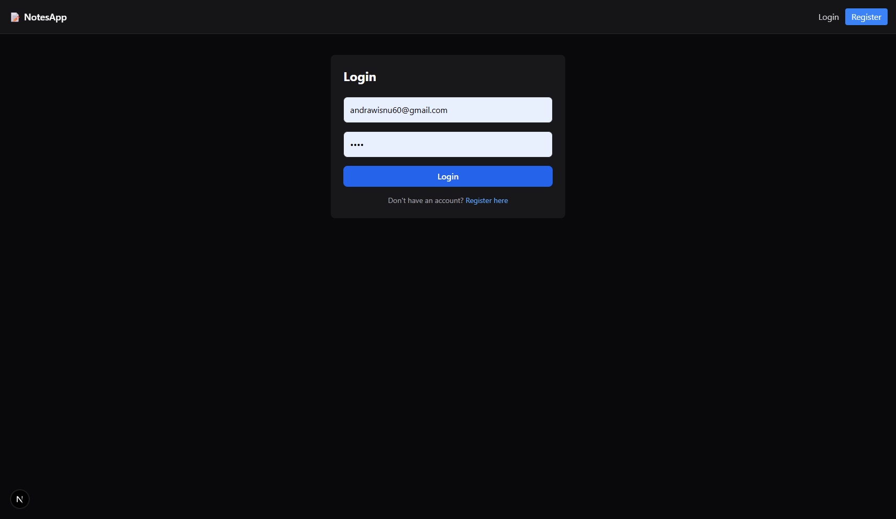

# Notes Sharing App

Aplikasi berbagi catatan berbasis web dengan fitur autentikasi, upload gambar, dan manajemen catatan pribadi.

## Tech Stack

### Backend
- *Go 1.25.2* - Backend API
- *GIN * - Web framework
- *PostgreSQL 16* - Database
- *JWT* - Authentication
- *bcrypt* - Password hashing

### Frontend
- *Next.js 15.5.4* - React framework
- *React 19.1.0* - UI library
- *TypeScript* - Type safety
- *Tailwind CSS v4* - Styling

## Fitur

- Autentikasi (Register & Login)
- Dashboard pengguna
- CRUD catatan pribadi
- Upload gambar untuk catatan

## Setup Local

### 1. Clone Repository

bash
git clone <repository-url>
cd notes-seleksi

### 2. Setup Database

Buat database PostgreSQL:

bash
psql -U postgres
CREATE DATABASE notessharing;
\q

Import schema database:

bash
psql -U postgres -d notes -f notes.sql

### 3. Setup Backend (Go)

bash
# Install dependencies
go mod download

# Jalankan server
go run main.go

Server akan berjalan di http://localhost:8081

### 4. Setup Frontend (Next.js)

bash
cd front-end

# Install dependencies
npm install

# Jalankan development server
npm run dev

Frontend akan berjalan di http://localhost:3000

## Setup dengan Docker

### Prerequisites

- Docker
- Docker Compose

### Jalankan dengan Docker Compose

bash
# Build dan jalankan semua services
docker-compose up --build

# Atau jalankan di background
docker-compose up -d --build

Services yang akan berjalan:
- *PostgreSQL*: localhost:5432
- *Backend API*: http://localhost:8081
- *Frontend*: http://localhost:3000

### Stop Services

bash
docker-compose down

# Hapus volumes juga (reset database)
docker-compose down -v

## Contoh .env

### Backend (.env di root project)

env
# Database Configuration
DB_HOST=localhost
DB_USER=postgres
DB_PASSWORD=leandra
DB_NAME=notessharing
DB_PORT=5432

# JWT Secret
JWT_SECRET=keripiktempe

# Server Configuration
PORT=8080

### Frontend (.env.local di folder front-end)

env
# API URL
NEXT_PUBLIC_API_URL=http://localhost:8080

*Note*: Untuk Docker, environment variables sudah dikonfigurasi di docker-compose.yml

## Screenshot Aplikasi

### Halaman Login

### Halaman Register

### Dashboard

### Halaman Notes

### My Notes

## API Endpoints

### Authentication
- POST /api/register - Register user baru
- POST /api/login - Login user

### Notes
GET    /notes                    --> Ambil semua catatan
GET    /notes/:id                --> Ambil catatan
POST   /notes                    --> Tambah Catatan (perlu JWT)
POST   /notes/image              --> Tambah Gambar (perlu JWT)
DELETE /notes/image/:id          --> Hapus Gambar (perlu JWT)
PUT    /notes/:id                --> Edit Catatan (perlu JWT)
DELETE /notes/:id                --> Hapus Catatan (perlu JWT

## Acknowledgments

- [GIN](https://gin-gonic.com/) - Go web framework
- [Next.js](https://nextjs.org/) - React framework
- [PostgreSQL](https://www.postgresql.org/) - Database
- [Tailwind CSS](https://tailwindcss.com/) - CSS framework
